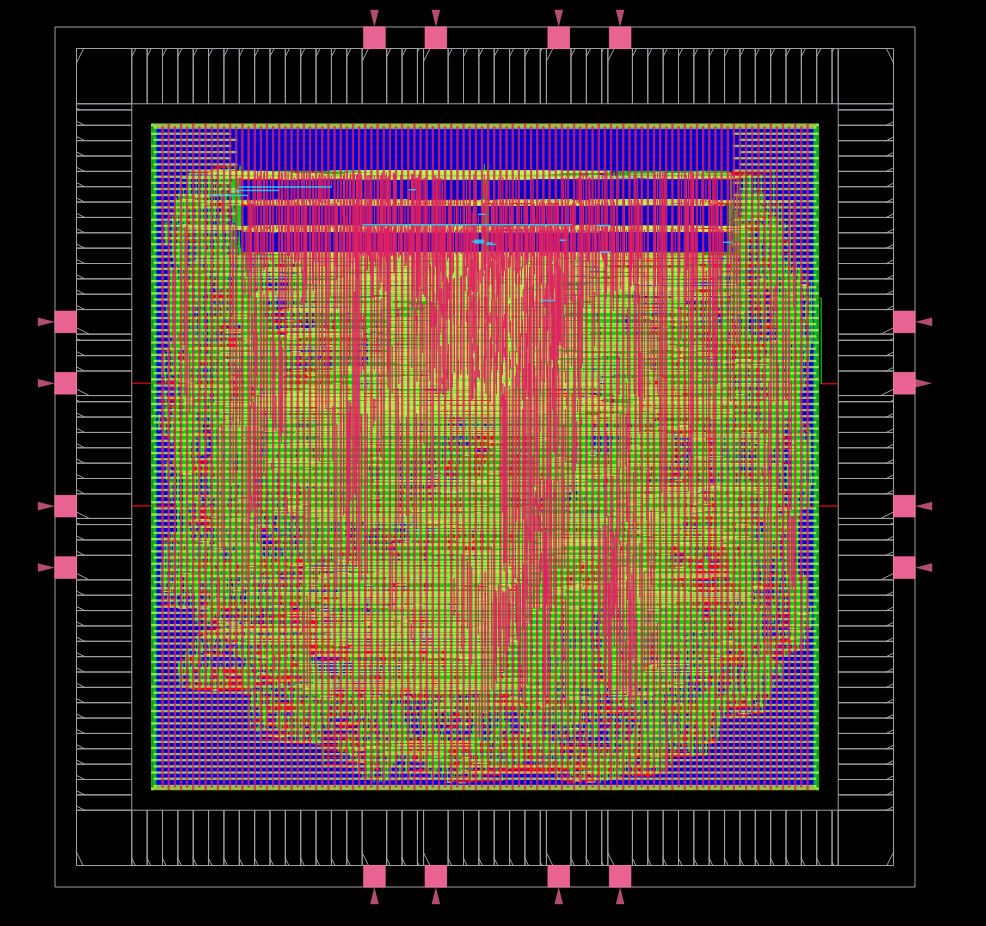
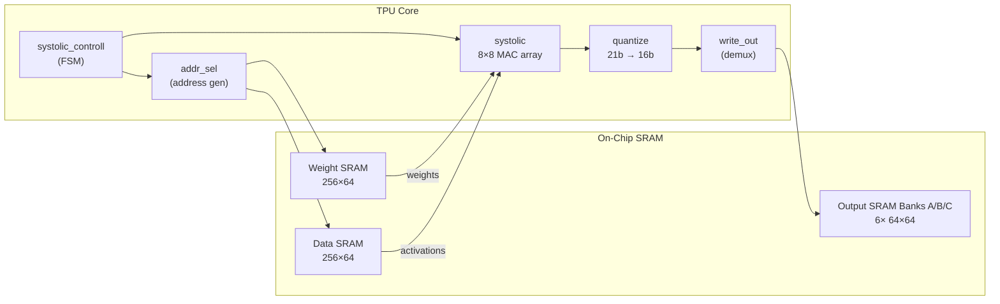
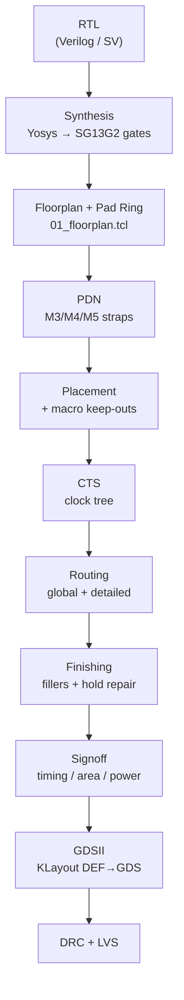

# 8×8 TPU ASIC — RTL-to-GDSII on IHP SG13G2 (130 nm)

[](LICENSE)
[](https://github.com/IHP-GmbH/IHP-Open-PDK)
[](https://theopenroadproject.org/)
[](https://github.com/Kishor5115/TPU8x8/actions/workflows/rtl-lint.yml)
[](#implementation-results-ppa)
[](#asic-design-flow)

A complete, open-source **8×8 systolic-array Tensor Processing Unit (TPU)** for INT8
matrix multiplication, taken all the way from **RTL to a tape-out-ready GDSII** on the
open **IHP SG13G2 130 nm** technology using a fully scripted **Yosys + OpenROAD** flow.



---

## Table of Contents
- [Overview](#overview)
- [Architecture](#architecture)
- [Repository Layout](#repository-layout)
- [ASIC Design Flow](#asic-design-flow)
- [Implementation Results (PPA)](#implementation-results-ppa)
- [Getting Started](#getting-started)
- [Simulation & Verification](#simulation--verification)
- [Signoff Reports](#signoff-reports)
- [Development History](#development-history)
- [Contributing](#contributing)
- [License](#license)
- [Acknowledgments](#acknowledgments)

---

## Overview

This project implements an 8×8 matrix-multiplication accelerator (TPU) as a hardened
ASIC macro with an integrated I/O pad ring. It pairs a throughput-optimized systolic
array with on-chip SRAM macros for weight, activation, and result storage, and closes
the design through a reproducible physical-design flow with automated signoff and GDS
generation.

### Key Features
- **8×8 Systolic Array** — 64 Multiply-Accumulate (MAC) units operating in parallel.
- **Output-Stationary Dataflow** — each PE accumulates one element of the result matrix.
- **SRAM-Backed Memory** — dedicated IHP SG13G2 SRAM macros for weights, activations, and outputs.
- **Full Pad Ring** — signal, power, and corner I/O pads with wire-bondable bondpads.
- **Open Technology** — targets the IHP SG13G2 130 nm Open PDK end-to-end.
- **Automated PnR** — single-command OpenROAD flow producing timing, area, power, DRC, and GDSII artifacts.

---

## Architecture

The TPU computes the matrix product $C = D \times W^{T}$, where $D$ is the data
(activation) matrix and $W$ is the weight matrix:

$$C[i][j] = \sum_{k=0}^{7} D[i][k] \times W[j][k]$$



### Dataflow
- **Type:** Output-Stationary — each cell `(i,j)` holds an accumulator for `C[i][j]`.
- **Weights ($W$):** enter from the top and flow down through the rows.
- **Data ($D$):** enter from the left and flow right across the columns.

### Input Skewing
To time-align partial products, inputs are fed with **diagonal skewing**:
- Row `i` of the data matrix is delayed by `i` cycles.
- Row `i` of the weight matrix is delayed by `i` cycles.
- Because a single SRAM address serves a 4-row group, the second group (rows 4–7)
  takes an additional 4-cycle offset to match the integrated memory architecture.

Results are written to the output SRAMs in **anti-diagonal** order.

| Component     | Specification                                   |
|---------------|-------------------------------------------------|
| Array Size    | 8×8 (64 MACs)                                   |
| Operand Width | 8-bit (INT8)                                    |
| Accumulator   | 21-bit internal, saturated to 16-bit (INT16)    |
| Clock Domain  | Single system clock — **100 MHz** target        |
| Input Memory  | 2× `RM_IHPSG13_1P_256x64` (Weight + Data)       |
| Output Memory | 6× `RM_IHPSG13_1P_64x64` (Banks A / B / C)      |

---

## Repository Layout

```text
.
├── rtl/                  # Verilog/SystemVerilog source
│   ├── tpu_chip.sv       #   Chip-level wrapper (pad ring + corners)
│   ├── tpu_top.v         #   Hard-macro top (core + SRAM macros)
│   ├── tpu_core.v        #   Datapath + control integration
│   ├── systolic.v        #   8×8 MAC array
│   ├── systolic_controll.v  # Control FSM
│   ├── addr_sel.v        #   SRAM read-address generator
│   ├── quantize.v        #   Saturating quantizer (21b→16b)
│   └── write_out.v       #   Output de-mux to SRAM banks
├── pnr/                  # OpenROAD physical-design flow (00–07 stages)
│   ├── flow.tcl          #   Top-level flow driver
│   ├── config.tcl        #   Design + timing configuration
│   ├── 0*_*.tcl          #   Stage scripts: init → floorplan → … → signoff
│   ├── klayout/          #   DEF→GDS streaming scripts
│   └── reports/signoff/  #   Timing / area / power / DRC reports
├── yosys/                # Synthesis scripts (yosys.tcl) + reports
├── sym/                  # Verification (pre-synth RTL + post-synth GLS + LVS)
├── ihp13/                # IHP SG13G2 Open PDK + bondpad collateral
├── scripts/              # Report visualization helpers
├── docs/                 # CHALLENGES.md, command reference, reports
├── env.sh.example        # Environment template (copy to env.sh)
└── Makefile              # Convenience targets (yosys, pnr, gds, drc, lvs)
```

---

## ASIC Design Flow



1. **Synthesis** — Yosys maps RTL to SG13G2 standard cells.
2. **Floorplan** — die/core definition, I/O pad ring, and bondpad placement.
3. **PDN** — power straps on M3/M4/M5 for robust delivery to logic and macros.
4. **Placement** — surgical placement blockages near SRAM macro corners.
5. **CTS** — clock-tree synthesis with high-drive buffers.
6. **Routing** — global + detailed routing with targeted M2 obstructions for spacing closure.
7. **Finishing** — filler/decap insertion and hold-time repair.
8. **Signoff** — timing, power, and area analysis with automated report generation, then DEF→GDS and DRC/LVS.

---

## Implementation Results (PPA)

> Source of truth: `pnr/reports/signoff/` (typical corner, 1.20 V, 25 °C).

### Performance
| Metric                | Value                          |
|-----------------------|--------------------------------|
| Target Frequency      | **100 MHz** (10 ns period)     |
| Setup Timing (WNS)    | 0.000 ns ✅ PASS               |
| Hold Timing (WNS)     | −0.000 ns ✅ PASS              |
| Achievable Fmax       | **~104 MHz** (period_min 9.64 ns) |
| Setup Clock Skew      | 0.97 ns                        |

### Power (Typical Corner)
| Group         | Internal | Switching | Leakage | Total      | %      |
|---------------|----------|-----------|---------|------------|--------|
| Sequential    | 14.9 mW  | 1.7 µW    | 1.3 µW  | 14.9 mW    | 46.3 % |
| Clock         | 11.8 mW  | 4.92 mW   | 14.8 µW | 16.7 mW    | 51.9 % |
| Combinational | 0.05 mW  | 0.45 mW   | 8.9 µW  | 0.52 mW    | 1.6 %  |
| Macro (SRAM)  | —        | —         | 0.69 µW | ~0 mW      | 0.0 %  |
| Pad           | 6.1 µW   | 35.8 µW   | —       | 0.042 mW   | 0.1 %  |
| **Total**     | **26.8 mW** | **5.41 mW** | **25.7 µW** | **32.2 mW** | 100 % |

### Area
| Metric                 | Value                                |
|------------------------|--------------------------------------|
| Die Size               | 2.8 mm × 2.8 mm (7.84 mm²)           |
| Core Area              | 4.569 mm²                            |
| Std-Cell Area          | 3.171 mm² (121,732 instances)        |
| Macro Area             | 0.489 mm² (8 SRAM instances)         |
| Core Utilization       | 80.1 %                               |
| Std-Cell Utilization   | 77.7 %                               |
| Technology             | IHP SG13G2 130 nm                    |

---

## Getting Started

### Prerequisites
- [OSS CAD Suite](https://github.com/YosysHQ/oss-cad-suite-build) (Yosys, Icarus Verilog, GTKWave)
- [OpenROAD](https://theopenroadproject.org/)
- [KLayout](https://www.klayout.de/) (for DEF→GDS, DRC, LVS)
- The IHP SG13G2 Open PDK (included under `ihp13/pdk/`)

### 1. Configure the environment
```bash
cp env.sh.example env.sh      # then edit tool paths for your machine
source env.sh
```

### 2. Run synthesis
```bash
make yosys
```

### 3. Run the full place-and-route flow
```bash
make pnr        # runs pnr/flow.tcl via: openroad -exit flow.tcl
```

### 4. Generate GDSII
```bash
make gds        # DEF → GDS via KLayout (pnr/klayout/def2gds.sh)
```

### 5. Run signoff checks (optional)
```bash
make drc        # KLayout DRC
make lvs        # KLayout LVS
make tapeout    # DRC + LVS
```

### 6. View the layout
```bash
make view-gds   # opens pnr/results/tpu_chip_final.gds in KLayout
```

Run `make help` to list all available targets.

---

## Simulation & Verification

The project ships a converged **master testbench** so the exact same matrix-math
checks run against both RTL and the final routed netlist. See
[`sym/VERIFICATION.md`](sym/VERIFICATION.md) for the full guide.

**RTL simulation (pre-synthesis)** — logic verification with a cycle-by-cycle MAC trace:
```bash
cd sym/pre_synth
make sim
```

**Gate-level simulation (post-synthesis)** — verifies the synthesized netlist:
```bash
cd sym/post_synth
make sim
```

---

## Signoff Reports

All reports live in `pnr/reports/signoff/`:

| Report      | File                | Description                       |
|-------------|---------------------|-----------------------------------|
| Summary     | `summary.rpt`       | Signoff overview                  |
| Timing      | `timing_final.rpt`  | Setup/hold path analysis          |
| Area        | `area.rpt`          | Die, core, std-cell, macro area   |
| Power       | `power.rpt`         | Power breakdown by group          |
| Clock Skew  | `clock_skew.rpt`    | Clock-network skew                |
| Clock Period| `clock_period.rpt`  | Achievable period / fmax          |
| Violations  | `violations.rpt`    | DRV violation counts              |

---

## Development History

See [`docs/CHALLENGES.md`](docs/CHALLENGES.md) for a detailed engineering post-mortem,
including SRAM downsizing for routability, hold-repair buffer explosions, surgical
Metal2 DRC fixes via the OpenDB API, and the GDS hierarchy-merge solution.

---

## Contributing

Contributions are welcome! Please read [`CONTRIBUTING.md`](CONTRIBUTING.md) and our
[`CODE_OF_CONDUCT.md`](CODE_OF_CONDUCT.md) before opening an issue or pull request.

---

## License

Licensed under the **Apache License 2.0** — see [`LICENSE`](LICENSE) for details.

---

## Acknowledgments
- **Google TPU Team** — architectural inspiration.
- **IHP Microelectronics** — the SG13G2 Open PDK.
- **The OpenROAD Project** — open-source RTL-to-GDSII EDA tooling.
