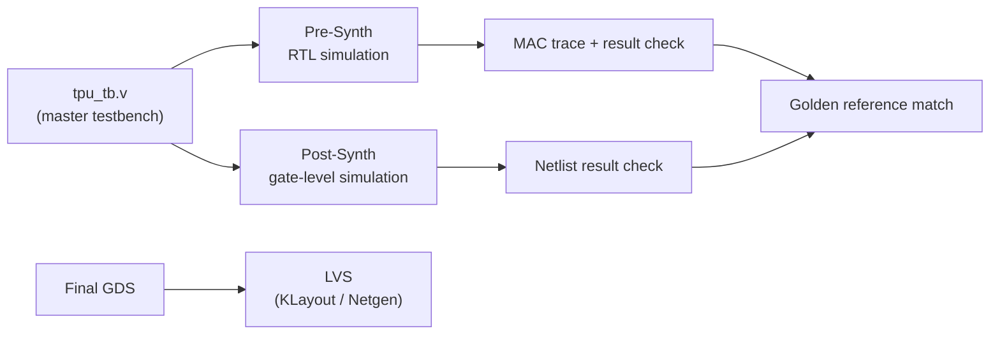

# TPU Verification Guide

[](../README.md)

This directory contains the functional and physical verification suite for the
**8×8 TPU** targeting the IHP SG13G2 130 nm technology. A single **converged
master testbench** drives both pre-synthesis (RTL) and post-synthesis
(gate-level) simulation, so the exact same matrix-math checks validate the
design at every stage of the flow.

---

## Directory Structure

```text
sym/
├── pre_synth/          # RTL simulation (golden / master source)
│   ├── tpu_tb.v        #   Unified master testbench (all test cases)
│   └── Makefile        #   Targets: make sim | make wave | make clean
│
├── post_synth/         # Gate-level simulation (GLS)
│   └── Makefile        #   Reuses the master TB with the routed netlist
│
└── lvs/                # Layout vs. Schematic
    └── README.md       #   LVS flow guide (KLayout / Netgen)
```

---

## Verification Flow



---

## Functional Simulation

The project uses a **converged master testbench**
([`pre_synth/tpu_tb.v`](pre_synth/tpu_tb.v)). Because the same testbench is reused
for both RTL and the synthesized netlist, any divergence between logic intent and
silicon-equivalent behavior is caught immediately.

### 1. Pre-Synthesis (RTL)
Verify the hardware logic before synthesis:
```bash
cd pre_synth
make sim      # compile + run (writes sim.log and tpu_master.vcd)
make wave     # open the waveform in GTKWave
make clean    # remove generated artifacts
```
> The RTL run emits a cycle-by-cycle **MAC trace** to `sim.log` for easy debugging.

### 2. Post-Synthesis (Gate-Level)
Verify the final routed netlist (silicon-equivalent) against the golden model:
```bash
cd post_synth
make sim      # gate-level simulation using the synthesized netlist
make clean
```

---

## Physical Verification (LVS)

To confirm the extracted layout matches the design schematic:
```bash
cd lvs
# Follow the step-by-step instructions in lvs/README.md
```

A repo-level convenience target is also available from the project root:
```bash
make lvs      # KLayout LVS against the final GDS
make tapeout  # DRC + LVS in one step
```

---

## Tools Required

| Tool             | Purpose                                   |
|------------------|-------------------------------------------|
| Icarus Verilog   | RTL and gate-level simulation (`-g2012`)  |
| GTKWave          | Waveform inspection                       |
| KLayout / Netgen | Physical verification (DRC / LVS)         |

Tool paths are configured by [`env.sh`](../env.sh) — copy `env.sh.example` to
`env.sh` and adjust for your machine before running any flow.
